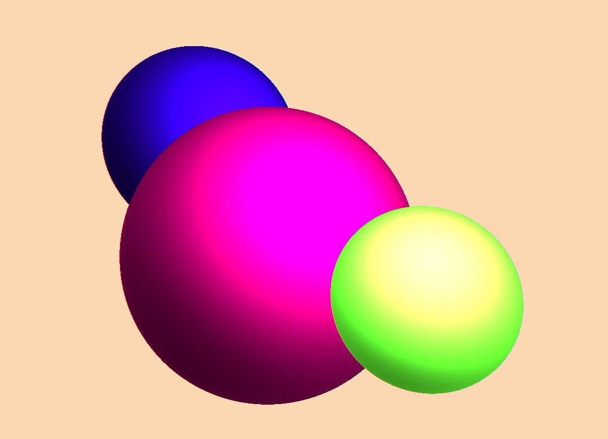

# Трассировка лучей
В данной работе реализована трассировка лучей для простейшего случая: три сферы разного радиуса и разных цветов
в разных точках пространства на однотонном фоне, один точечный источник света, теней и отражений нет.

